# Blog Agent System

A Claude Code agent system that produces production-ready, SEO/GEO/AIO-optimized blog posts as markdown files with full schema markup. Six specialized sub-agents run in sequence: **Researcher → Strategist → Writer → Editor → Schema Builder → Header Designer**.

The output is a self-contained article folder under `articles/` ready to be published — typically by the sibling tool [`blogsagent/`](blogsagent/), which ships markdown to HubSpot.

---

## Documentation map

Read in this order depending on what you need:

| If you want… | Read |
|---|---|
| **The fastest path** from zero to a published draft | **[QUICKSTART.md](QUICKSTART.md)** — one-page operator handbook |
| **The big picture** of what this is and how it's organized | **README.md** (this file) |
| **The full architecture** — every executable, every phase, every design decision | **[ARCHITECTURE.md](ARCHITECTURE.md)** |
| **The runtime orchestrator** Claude reads automatically when you ask for an article | **[CLAUDE.md](CLAUDE.md)** |

---

## How to invoke

Inside Claude Code, in this repository, just say what you want:

- `Write an article about agentic procurement automation`
- `Write an article about RAG vs fine-tuning, target keyword "rag vs fine-tuning"`
- `Write an article using this outline: <paste outline>`
- `Draft a long-form piece on AI workers for finance teams`

Claude reads `CLAUDE.md` automatically, recognizes the request, and runs the five-phase pipeline. Each phase reads its sub-agent spec from `agents/`, uses standards from `standards/`, and writes outputs into a fresh folder under `articles/YYYY-MM-DD-slug/`.

---

## The pipeline

```mermaid
flowchart LR
    U([User prompt]) --> O[Orchestrator<br/>CLAUDE.md]
    O --> F[(Create<br/>articles/YYYY-MM-DD-slug/)]
    F --> R[Phase 1<br/>Researcher]
    R -->|research-notes.md| S[Phase 2<br/>Strategist]
    S -->|outline.md| W[Phase 3<br/>Writer]
    W -->|article.md draft| E[Phase 4<br/>Editor]
    E -->|article.md edited| SB[Phase 5<br/>Schema Builder]
    SB -->|schema.json + embedded JSON-LD| A[Audit<br/>scripts/seo_audit.py]
    A --> D([Done — folder ready])
```



ASCII fallback:

```
user
  └── orchestrator (CLAUDE.md)
        └── creates articles/YYYY-MM-DD-slug/
              ├── 1. researcher  → research-notes.md
              ├── 2. strategist  → outline.md
              ├── 3. writer      → article.md (draft)
              ├── 4. editor      → article.md (polished)
              └── 5. schema      → schema.json + embed in article.md
              ↓
              audit → done
```

Every phase has a **gate condition** (defined in `CLAUDE.md`) that must be met before the next phase runs.

---

## What lands on disk

Each generated article lives at:

```
articles/YYYY-MM-DD-slug/
├── article.md          # full post: frontmatter + body + embedded JSON-LD + edit summary
├── schema.json         # validated JSON-LD @graph
├── meta.json           # title, slug, meta_description, keywords, canonical_url
├── research-notes.md   # sources, citations, entities, gaps (Phase 1 output)
└── outline.md          # strategy + outline (Phase 2 output)
```

`article.md` is the file you ship. `schema.json` is duplicated inside `article.md` as a fenced ```json-ld block so single-file consumers (HubSpot, etc.) get the schema for free.

---

## Project layout

```
.
├── CLAUDE.md                     # Master orchestrator (Claude reads this automatically)
├── README.md                     # This file
├── agents/
│   ├── researcher.md             # Phase 1 spec
│   ├── strategist.md             # Phase 2 spec
│   ├── writer.md                 # Phase 3 spec
│   ├── editor.md                 # Phase 4 spec
│   └── schema-builder.md         # Phase 5 spec
├── context/                      # Company proprietary context (populate over time)
│   ├── brand/                    # Brand voice, positioning, taglines, do's & don'ts
│   ├── sales/                    # ICP profiles, objections, value props, battle cards
│   ├── marketing/                # Strategy, target keyword list, persona docs
│   ├── finance/                  # Pricing, ROI talking points
│   └── author-style/             # Author bio, sample writing, voice guide
├── standards/
│   ├── seo-checklist.md          # Traditional SEO bar
│   ├── geo-checklist.md          # Generative-engine optimization bar
│   ├── aio-checklist.md          # AI-engine citation bar
│   ├── schema-spec.md            # JSON-LD reference + example @graph
│   └── quality-bar.md            # Banned phrases, voice rules, fact-check rules
├── scripts/
│   ├── new_article.py            # Scaffold a new article folder
│   ├── validate_schema.py        # Validate JSON-LD
│   └── seo_audit.py              # Audit a finished article folder
├── templates/
│   ├── article-template.md       # Frontmatter + body skeleton
│   └── schema-template.json      # Base @graph skeleton
└── articles/                     # One subfolder per article
```

---

## Populating `context/`

The five context folders are intentionally empty at start. Drop documents in as you build them — agents pick them up automatically the next time they run. No code changes needed.

| Folder              | What goes here                                                                 |
| ------------------- | ------------------------------------------------------------------------------ |
| `context/brand/`    | Brand voice doc, positioning statement, mission, taglines, do's & don'ts.      |
| `context/sales/`    | ICP profiles, top objections, value-prop one-pagers, competitive battle cards. |
| `context/marketing/`| Content strategy, target-keyword list, campaign briefs, persona docs.          |
| `context/finance/`  | Pricing pages, ROI calculators, cost-comparison data, financial talking points.|
| `context/author-style/` | Author bio, two or three sample articles, vocabulary preferences, style notes. |

Until any of these are populated, agents fall back to defaults defined in `agents/writer.md` and `standards/quality-bar.md`.

---

## Extending the system

**Add a new sub-agent.** Drop a new spec into `agents/your-agent.md`, then add a phase to the pipeline in `CLAUDE.md` (specify when it runs, what it loads, what it outputs, gate condition).

**Add a new standard.** Drop a new file into `standards/your-standard.md`, then reference it from the relevant agent specs (most often Editor and Strategist).

**Add a new schema type.** Add the type and example to `standards/schema-spec.md`, update the `@graph` skeleton in `templates/schema-template.json`, and extend `scripts/validate_schema.py` if you want hard validation on the new type.

**Tighten the audit.** Edit `scripts/seo_audit.py` — it's intentionally simple (stdlib only) so it stays easy to modify.

---

## Conventions

- **Slugs** are lowercase, hyphenated, ≤ 60 chars, keyword-forward.
- **Folders** are `YYYY-MM-DD-slug`. The date is the *creation* date; the article's own `publish_date` frontmatter can differ.
- **Citations** are inline in `article.md` body ("According to a 2025 Stanford study…") and structured in the JSON-LD `citation` array. Both must trace back to `research-notes.md`. No exceptions.
- **Banned phrases** (in `standards/quality-bar.md`) are non-negotiable. The Editor strips them.

---

## Running scripts directly

```bash
# Scaffold a new article folder manually
python scripts/new_article.py "rag-vs-fine-tuning"

# Validate any JSON-LD file
python scripts/validate_schema.py articles/2026-04-29-rag-vs-fine-tuning/schema.json

# Audit a finished article folder
python scripts/seo_audit.py articles/2026-04-29-rag-vs-fine-tuning/
```

All three scripts use only the Python standard library.
